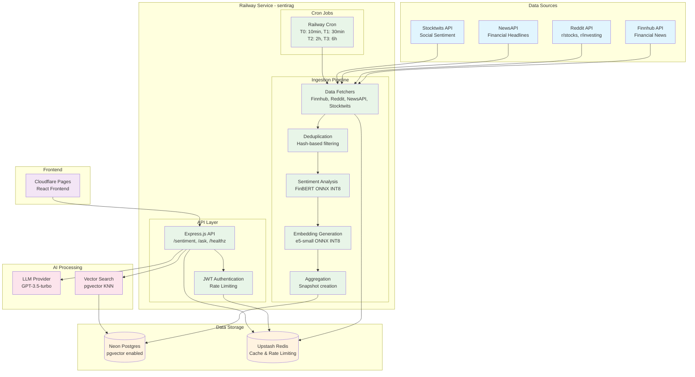

# MarketMood - RAG Stock Sentiment Analysis

A lightweight, real-time stock sentiment analysis system that aggregates data from multiple sources and provides AI-powered insights through a RAG (Retrieval-Augmented Generation) architecture.

## 🎯 Overview

MarketMood tracks sentiment across 40+ stock tickers in 4 priority tiers, ingesting data from news, social media, and financial APIs. The system processes this data through sentiment analysis and vector embeddings, enabling intelligent Q&A about market sentiment.

## 🏗️ Architecture

## 🔄 Information Flow

### 1. **Data Ingestion** (Cron-driven)
- **Railway Cron** triggers ingestion based on ticker tier priority
- **Data Fetchers** collect headlines and social posts from external APIs
- **Deduplication** removes duplicate content using hash-based filtering
- **Caching** stores raw API responses in Redis (15-30 min TTL)

### 2. **Processing Pipeline**
- **Sentiment Analysis**: FinBERT model processes text → sentiment scores
- **Embedding Generation**: e5-small model creates 384-dim vectors
- **Aggregation**: Creates snapshots with mean scores, ratios, and top mentions
- **Storage**: Snapshots and embeddings stored in Postgres with pgvector

### 3. **Query Processing**
- **Vector Search**: User queries embedded and matched against stored vectors
- **Retrieval**: KNN search returns most relevant snippets (24h window)
- **LLM Synthesis**: GPT-3.5 generates grounded responses with citations
- **Caching**: Answers cached in Redis (30 min TTL)

## 🛠️ Tech Stack

### Backend
- **Runtime**: Node.js 18+ with TypeScript
- **Framework**: Express.js
- **ML Models**: FinBERT + e5-small (ONNX INT8 quantized)
- **Deployment**: Railway

### Data Storage
- **Primary DB**: Neon Postgres with pgvector extension
- **Cache**: Upstash Redis
- **Vector Search**: pgvector HNSW indexes

### Frontend
- **Framework**: React with TypeScript
- **Hosting**: Cloudflare Pages
- **Features**: Real-time charts, Q&A interface, citation display

### External APIs
- **Financial**: Finnhub (news, sentiment)
- **Social**: Reddit (r/stocks, r/investing)
- **News**: NewsAPI (financial headlines)
- **Social Trading**: Stocktwits (sentiment)

## 🎯 Key Features

- **Real-time Sentiment**: Track 40+ tickers across 4 priority tiers
- **Multi-source Data**: News, Reddit, Stocktwits, Finnhub
- **AI-powered Q&A**: RAG-based responses with citations
- **Cost-effective**: ≤$15/month on Railway + free external services
- **Lightweight**: No long-running workers, cron-based ingestion
- **Scalable**: Vector search with pgvector, Redis caching

## 📈 Performance Targets

- **API Response**: p95 < 700ms (excluding LLM)
- **Ingestion Latency**: < 5 minutes per tier
- **Uptime**: > 99.5%
- **Cost**: ≤ $15/month on Railway

